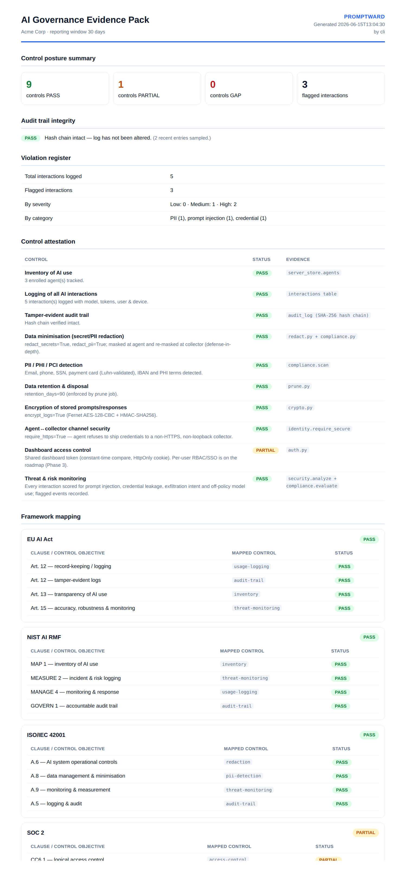

<div align="center">

# Promptward

### Self-hosted monitoring, audit, and AI governance for teams on individual Claude accounts

*Know who is using Claude, on what, with what data — and prove it to your auditors.*

[Quick start](#quick-start) · [The problem](#the-problem) · [How it works](#how-it-works) ·
[Security by layer](#security-by-layer) · [AI compliance](#ai-compliance-and-governance) · [Installation](#installation)

<br>

[](https://gauravpatil97886.github.io/Promptward/)

<sub>Live overview — <a href="https://gauravpatil97886.github.io/Promptward/">gauravpatil97886.github.io/Promptward</a> · source: <a href="docs/overview.html"><code>docs/overview.html</code></a></sub>

</div>

---

## See it

| Live security dashboard | Signed compliance evidence pack |
|:--:|:--:|
| [](screenshot.png) | [](docs/sample-evidence-pack.html) |
| Activity, endpoints, threats, tokens, sessions — updated live. | One-click auditor deliverable: control attestation + framework mapping, HMAC-signed. [View the sample →](docs/sample-evidence-pack.html) |

---

## The problem

Anthropic's admin console, usage logs, and member management exist **only for Claude Team and
Enterprise** plans. A large number of organizations run on **individual Claude / Claude Code
accounts** — every employee signs in with their own personal account and API key. Those organizations have:

- **No admin visibility** — who is using Claude, and for what?
- **No usage monitoring** — tokens, models, volume, by person or team.
- **No AI audit trail** — nothing to show a security review or regulator.
- **No DLP** — secrets, source code, and customer PII pasted into prompts go unnoticed.

**Promptward is that missing layer.** It sits on the network path between any Claude tool and
Anthropic's API — so it works no matter which individual account an employee uses — and gives
the IT, security, and compliance team one dashboard and admin panel to run it. No Anthropic
Enterprise plan required.

## What we built (and how it solves it)

| You need | Promptward gives you | How |
|----------|-----------------------|-----|
| See all AI usage | Live dashboard: activity, endpoints, models, tokens, sessions | Thin agent to central collector to dashboard |
| Catch risky prompts | Threat detection: injection, secrets, exfiltration | `common/security.py` rule engine, server-enforced |
| Stop data leaks | Secret and PII/PHI/PCI **redaction before storage** | `redact.py` + `compliance.py`, masked at the agent *and* the collector |
| Prove compliance | **Signed, framework-mapped evidence pack** + tamper-evident audit log + violation register | `evidence.py` (HMAC-signed), `audit.py` hash chain, `reports.py` |
| Run it safely | Per-agent keys, dashboard token, HTTPS-only credentials, retention | `auth.py`, `identity.require_secure`, `prune.py` |
| Never break Claude | **Fail-open** — agent forwards to Anthropic regardless of Promptward | independent forward path + disk spool |

## How it works

```
 EMPLOYEE LAPTOP                                   CENTRAL SERVER (one box)
 ---------------                                   ------------------------
 claude / VS Code / SDK
   | ANTHROPIC_BASE_URL -> 127.0.0.1:9099
   v
 +----------------------+   forwards directly    +------------------+
 |  pw (thin agent)     | ---------------------> |  api.anthropic   |
 |  - redact secrets+PII|                        |     .com         |
 |  - detect threats    |   event (HTTPS,        +------------------+
 |  - fail-open + spool  |   per-agent key)
 +----------+-----------+ --------------------->  +-------------------------------+
            | Claude keeps working even          |  pw server                    |
            | if the server is down              |  - collector (ingest, auth)   |
                                                 |  - re-analyze (security+compl)|
                                                 |  - encrypted store + retention|
                                                 |  - dashboard + /admin panel   |
                                                 |  - hash-chained audit log     |
                                                 +-------------------------------+
                                                team browser --token--> dashboard
```

**Key property:** the forward to Anthropic never depends on the server. If the collector or
network is down, the user's Claude call still succeeds, and the log event spools to disk and
replays later. Promptward can never break Claude.

## Security by layer

| Layer | Control |
|-------|---------|
| **Employee to Anthropic** | Agent forwards unmodified, streams with zero added latency; never logs the user's API key |
| **On the machine** | Secrets and PII masked **before** anything is stored or sent; local DB encrypted (Fernet) |
| **Agent to Server** | Per-agent API keys (hashed at rest, constant-time compare); **HTTPS enforced** for credentials; keys **rotatable** and revocable |
| **Server ingest** | Re-runs detection server-side (cannot be downgraded by a forged agent); identity bound to the authenticated agent, not the payload |
| **Team to Dashboard** | Token gate; refuses non-loopback bind without a token; HttpOnly cookie |
| **Governance** | Tamper-evident hash-chained audit log; every admin mutation recorded; `verify()` detects edits |
| **Data lifecycle** | Configurable retention and auto-prune; GDPR Art. 17 right-to-erasure by user or device |

Toggle most of these live in **Admin to Settings** (no restart): redaction, HTTPS enforcement,
retention, large-prompt threshold, allowed/denied models, consent banner.

## AI compliance and governance

Built for security, audit, and compliance teams:

- **Sensitive-data / DLP detection** — emails, phones, SSNs, payment cards (Luhn-validated),
  IBANs, and PHI terms are flagged and **redacted**.
- **AUP policy packs** — configurable org rules ("no prod DB content", "no secrets in prompts")
  feed a **violation register**.
- **Model governance** — allow or deny which Claude models may be used; off-policy use is flagged.
- **Tamper-evident audit trail** — hash-chained log of AI interactions and admin actions.
- **Right to erasure (GDPR Art. 17)** — delete a subject's data by user or device, audited.
- **Retention and minimization** — keep-N-days plus redaction (GDPR Art. 5).
- **Consent and disclosure** — monitoring notice at install plus a configurable dashboard banner.
- **Framework mapping** — EU AI Act, NIST AI RMF, ISO/IEC 42001, SOC 2, GDPR.
- **Signed evidence packs** — one command produces a self-contained, **HMAC-signed** governance
  artifact (inventory + violation register + audit verification + per-control attestation mapped
  to all five frameworks). Render it as JSON for machine verification or as a print-to-PDF HTML
  document for auditors. Control statuses are derived from **live system state** — the pack can't
  claim a control that isn't actually on.
- **Export** — CSV or SIEM webhook for your audit pipeline.

```bash
pw evidence --format html -o evidence-pack.html   # auditor-ready document
pw evidence -o pack.json                          # signed, machine-verifiable
pw evidence --verify pack.json                    # VERIFIED — ok  (detects any edit)
```

### Why not just use an LLM gateway (e.g. LiteLLM)?

Gateways govern the **applications you build** — apps must route through a managed virtual key.
Promptward governs the **people using Claude** on their own individual accounts (Claude Code CLI,
the VS Code extension, SDK apps) — which a gateway never sees. And where gateways paywall audit
logs and map to no compliance framework, Promptward's **signed, framework-mapped evidence pack and
tamper-evident audit log are open source**. The two are complementary, not competing: run a gateway
for your apps and Promptward for your workforce.

## Quick start

Try it on one machine:

```bash
./scripts/install.sh
pw proxy &
export ANTHROPIC_BASE_URL=http://127.0.0.1:9099   # this terminal only
pw dashboard                                      # http://127.0.0.1:9100
```

## Installation

Two sides, each with its own guide:

- **Server (security team), one box:** [`deploy/server/README.md`](deploy/server/README.md)
  — `docker compose up -d`
- **Agent (employee laptops), one line:** [`deploy/agent/README.md`](deploy/agent/README.md)
  — `curl -fsSL https://<server>/install-agent.sh | PW_SERVER=… PW_ENROLL_TOKEN=… bash`

**Overview page.** The marketing/overview page is published as a static site for stakeholders.
It is self-contained (no build step) and is emitted to [`index.html`](index.html),
[`docs/index.html`](docs/index.html), and [`docs/overview.html`](docs/overview.html) so it can be
served by GitHub Pages whether you deploy from the repository root or the `/docs` folder.

To publish on GitHub Pages: **Settings → Pages → Build and deployment → Deploy from a branch**,
then choose `main` and either `/ (root)` or `/docs`.

## Project layout

```
src/promptward/
  common/   config, crypto, security, redact, compliance, storage
  agent/    forwarder, shipper, spool, enroll, service, identity, notifier
  server/   collector, dashboard, admin, auth, server_store, audit, reports, evidence, evidence_report, prune, app
  cli/      pw entry point
deploy/agent/   employee laptop install
deploy/server/  central server install (compose, env)
docs/           architecture, security, operations, overview.html
index.html      published overview page (GitHub Pages)
```

## Development

```bash
pip install -e ".[dev,server]"
pytest          # 30 tests
ruff check src tests
mypy src
```

## Documentation

[Architecture](docs/architecture.md) · [Security and threat model](docs/security.md) ·
[Operations runbook](docs/operations.md) · [Roadmap](docs/roadmap.md) ·
[Changelog](CHANGELOG.md) · [Contributing](CONTRIBUTING.md)

## Maintainer

Maintained by [Gaurav Patil](https://github.com/gauravpatil97886).

## License

[Apache-2.0](LICENSE) — open source.
